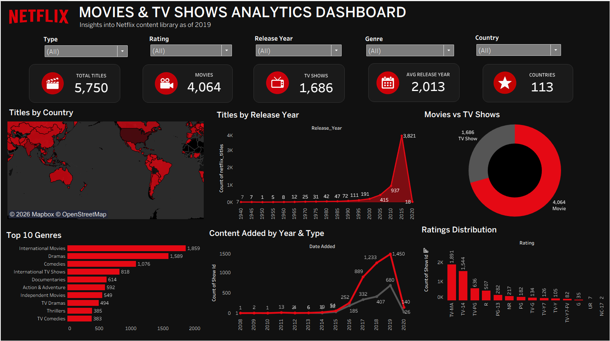

# Netflix Movies & TV Shows Analytics Dashboard

## Project Overview

This project is an interactive Netflix Movies & TV Shows Analytics Dashboard created using Tableau Public.

The dashboard provides insights into Netflix's content library, including movies, TV shows, ratings, genres, countries, release years, and content additions over time.

## Objectives

- Analyze the distribution of Movies and TV Shows
- Identify the countries with the highest number of Netflix titles
- Analyze Netflix content by release year
- Identify the Top 10 genres
- Analyze content added by year and type
- Understand the distribution of Netflix ratings

## Tools & Technologies

- Tableau Public
- Microsoft Excel
- Data Visualization
- Data Analysis

## Dashboard Features

- Total Titles
- Total Movies
- Total TV Shows
- Average Release Year
- Number of Countries
- Titles by Country
- Titles by Release Year
- Movies vs TV Shows
- Top 10 Genres
- Content Added by Year & Type
- Ratings Distribution

## Filters

The dashboard includes interactive filters for:

- Type
- Rating
- Release Year
- Genre
- Country

## Project Structure

- `Netflix - Project.twbx` — Tableau workbook
- `Dataset/` — Dataset used for the project
- `Assets/` — Dashboard logos and icons
- `Screenshots/` — Dashboard screenshots

## Dashboard Preview

## Tableau Public

[View the Interactive Dashboard on Tableau Public](https://public.tableau.com/app/profile/khushi.lakhotia/viz/NetflixMoviesTVShowsAnalyticsDashboard_17885516680600/Dashboard1)

## Author

**Khushi Lakhotia**
